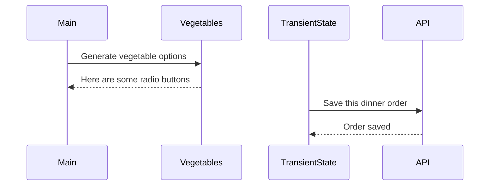

# Events and State Self-Assessment

> 🧨 Make sure you answer the vocabulary and understanding questions at the end of this document before notifying your coaches that you are done with the project

## Setup

1. Make sure you are in your `workspace` directory
1. `git clone {github repo SSH string}`
1. `cd` into the directory it creates
1. `code .` to open the project code
1. Use the `serve` command to start the web server
1. Open the URL provided in Chrome

## Requirements

### Initial Render

1. All 10 base dishes should be displayed as radio input options.
1. All 9 vegetables should be displayed as radio input options.
1. All 6 side dishes should be displayed as radio input options.
1. All previously purchases meals should be displayed below the meal options. Each purchase should display the primary key and the total cost of the purcahsed meal.

### State Management

1. When the user selects an item in any of the three columns, the choice should be stored as transient state.
1. When a user makes a choice for all three kinds of food, and then clicks the "Purchase Combo" button, a new sales object should be...
    1. Stored as permanent state in your local API.
    1. Represented as HTML below the **Monthly Sales** header in the following format **_exactly_**. Your output will not have zeroes, but the actual amount.
        ```html
        Receipt #1 = $00.00
        ```
   1. The user's choices should be cleared from transient state once the purchase is made.

## Design

Given the description and animation above...

1. Create an ERD for this application before you begin.
1. Make a list of what modules need to be created to make your application as modular as possible. Create a **Dependency Graph** for the project to be reviewed once you are complete with the assessment.
1. Create a **Sequence Diagram** that visualizes what your algorithm is for this project. We'll give you a minimal starting point.



## Vocabulary and Understanding

> 🧨 Before you click the "Assessment Complete" button on the Learning Platform, add your answers below for each question and make a commit. It is your option to request a face-to-face meeting with a coach for a vocabulary review.

1. Should transient state be represented in a database diagram? Why, or why not?
   > Absolutely. The client will be interacting with the page when selecting with radio buttons or drop down boxes. The options coded for those inputs record the changes in the transient state and should include the primary keys of what the client has selected. The idea of making these selections is to enter an order, make a purchase, or in some way the client make a request of the site and that data needs to be stored for our use. The transient state should be represented in ERDs with their relationships visualizing user input and current data. 
2. In the **FoodTruck** module, you are **await**ing the invocataion of all of the component functions _(e.g. sales, veggie options, etc.)_. Why must you use the `await` keyword there? Explain what happens if you remove it.
   > The requested data we are using in the component functions are making networks requests to a server over the World Wide Web. Naturally, it takes time for the server to receive our request, and then for the server to generate our expectant response. The await keyword specifically allows the code to stop execution until the promise of the request is fulfilled. Otherwise, without the await keyword in our asynchronous functions, our code would continue to execute with the promise being either rejected or resolved. Instead, we would receive a promise object pending, not fulfilled. 
3. When the user is making choices by selecting radio buttons, explain how that data is retained so that the **Purchase Combo** button works correctly.
   > In our transient state module, there is created a default object with values set to 0, if an integer, false, if a boolean, or " ", if an empty string. We expect these keys' values to be modified by user input. Following the default object in the transient state module there are function that redefine the values of the keys in the default object based on their input. These functions are called setter functions. When the user makes input onto the page, the input is received and changes the values of the selected key with the user-input choice. These setter functions are handled in the keys' respective modules. For example, see the entrees module and notice the handler. It is waiting for the user to click on one of the family radio buttons, grouped by name for a one-to-one input. When the change event is heard, the handle function runs, invoking the setter function.
4. You used the `map()` array method in the self assessment _(at least, you should have since it is a learning objective)_. Explain why that function is helpful as a replacement for a `for..of` loop.
   > It is less code to write. It is also an array method and there is a large array of them. For of loops can really only perform one task, that is to iterate through an array. That is exactly what array methods do as well, but the variety of them specify a particular function carried out on each iteration of an array. This makes the .map array method a little more interesting because not only is it executing a function for every iteration in an array, but the function can be defined as we need it to be.
